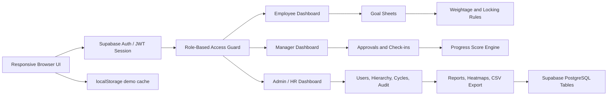

# AtomQuest Goal Setting & Tracking Portal

This is a browser-based enterprise demo implementation of the AtomQuest Hackathon 1.0 BRD for an **In-House Goal Setting & Tracking Portal**.

## How to Run

Run the local frontend server and open the site:

```powershell
node dev-server.js
```

Then open `http://localhost:5173`.

The app is integrated with Supabase Auth/profiles and also includes a local demo-session fallback for hackathon judging. Use **Reset demo data** to restore the seeded state.

## Supabase Setup

Backend project:

`https://hfngakvgrdgvrjobjkqq.supabase.co`

Run `supabase-schema.sql` in the Supabase SQL Editor before using the app. It creates the `app_state` and `profiles` tables, enables Row Level Security, and blocks client-side profile creation/role mutation. Public signup should stay disabled in Supabase; Admin-created users must have rows in `profiles`.

## Demo Users

All demo users use password `AtomQuest@123` in local demo mode:

- Employee: `ananya@atomquest.com`
- Employee: `rohan@atomquest.com`
- Manager (L1): `meera@atomquest.com`
- Admin/HR: `admin@atomquest.com`

The login screen shows Employee, Manager, and Admin access lanes. A user can enter only through the role assigned in the database/profile.

## Implemented Scope

- Employee goal creation and submission
- Role-based authentication lanes with protected dashboard routing
- Admin-created user model with no public signup UI
- Validation for total weightage, minimum weightage, and max goal count
- Manager approval, return for rework, inline target and weightage edits
- Goal lock after approval
- Shared departmental KPI push
- Quarterly achievement capture
- Manager check-in comments
- Progress score calculation by UoM type
- Admin cycle status, completion dashboard, and unlock workflow
- Admin user management, role assignment, hierarchy table, escalation workflow, and integration readiness panels
- Audit trail
- Achievement reports, completion dashboard, activity tracking, team performance analytics, goal distribution analysis, heatmaps, manager effectiveness reporting
- CSV achievement report export

## Architecture



## Live Demo / Repository

This workspace contains the runnable repository contents. For live hosting, deploy these static files to Vercel/Netlify and configure the Supabase URL/key in `app.js`, or move the same workflow into a Next.js + Node.js API deployment on Vercel and Render/Railway/AWS.

## Production Upgrade Path

For a hosted production version, split the JSON state into normalized database tables:

- Frontend: React or Next.js
- Backend: Node.js API or Next.js server actions
- Database: PostgreSQL
- Auth: Microsoft Entra ID
- Notifications: Email and Microsoft Teams
- Exports: Server-generated CSV/XLSX
